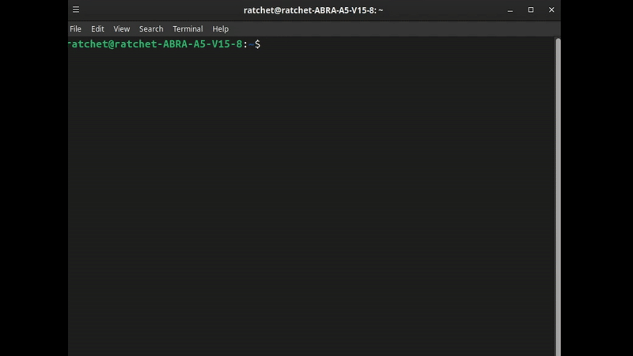
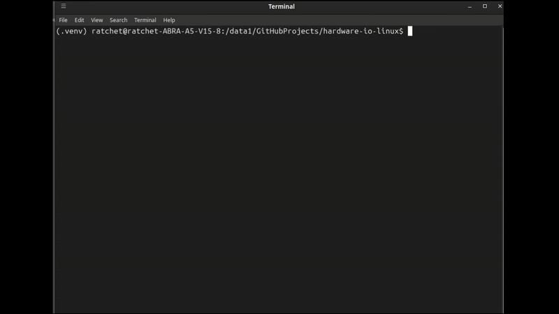

# Portfolio

## Linux Tmux and Git PR's

[Click for Details](https://github.com/CanGitArchive/linux-git-demo)

  

## Linux CLI Hardware I/O

[Click for Details](https://github.com/CanGitArchive/hardware-io-linux)

  

## Networking with Robots

[Click for Details](https://github.com/CanGitArchive/networking-lab)

  

## RoS2 Basics

  

## C++, Signal Processing and Prosthetic Hand Project

[Prosthetic Hand](https://github.com/CanGitArchive/Prosthetic-Hand-Single-EMG-Multi-Pattern)

## Python use example

[Simple Workout App](https://github.com/CanGitArchive/WorkoutHelpers)

## Godot AARPG Example

[Simple AARPG game](https://github.com/CanGitArchive/aarpg)

## Spraying Drone Test Video and Pictures

[Drone](https://github.com/CanGitArchive/Drone-Test)

## Articles

[Published Prosthetic Hand](https://as-proceeding.com/index.php/ijanser/article/view/1728)

[Prepublished Prosthetic Hand Improvement](https://doi.org/10.48550/arXiv.2504.15256)
