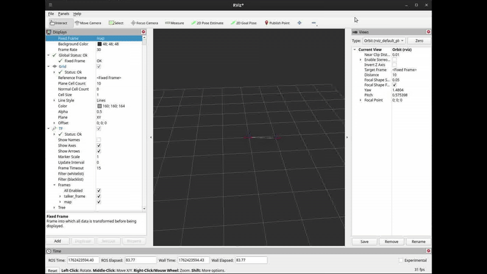
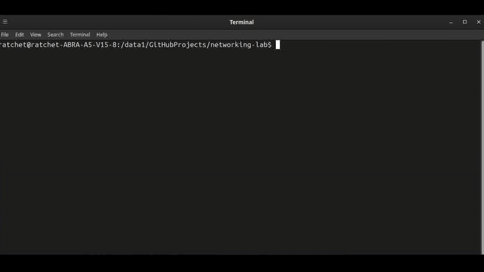
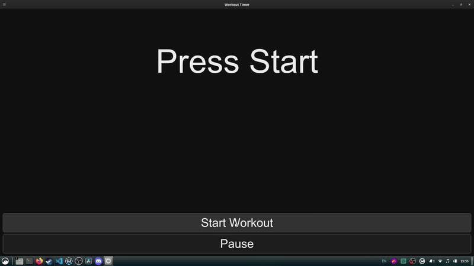

# Can Kadılar — Mechatronics / Robotics Portfolio

**Entry-level Mechatronics Engineer (M.Sc., GPA 3.71)** designing, building, and integrating robotic/automation systems.  
**Status:** Canadian citizen · Based in Turkey (moving to Canada upon offer) · Open to Canada & US (TN eligible).  
**Contact:** kadilarmustafacan@gmail.com · [LinkedIn](https://www.linkedin.com/in/can-kadilar)

---

## What I bring
- **Hands-on robotics stack:** Linux (Ubuntu 24.04), Git, ROS 2 (Jazzy) nodes/topics/services/params, RViz/TF.
- **Hardware + embedded:** ESP32/Arduino, I²C/SPI, sensor bring‑up, serial logging, udev rules, basic PLC (S7-200).
- **Mechanical/CAD:** SolidWorks, Fusion 360, Siemens NX; design-for-assembly; fixture/gripper basics.
- **Data & controls flavor:** MATLAB, Python, C++; simple control loops; logging/plotting.
- **Ops mentality:** networking basics (VLAN, DHCP/static IP), checklists, IO bring-up, reproducible repos.

> I’m looking for **Mechatronics / Robotics / R&D / Mechanical Design** roles (junior–intermediate). Remote, hybrid, or onsite.

---

## Short demos of work

### 1) ROS 2 Essentials — talker/listener + params + RViz/TF
Repository: **[CanGitArchive/ROS2](https://github.com/CanGitArchive/ROS2)**  
What’s inside: publisher/subscriber, parameter control (`hz`), service (`reset_counter`), launch files, and TF broadcasting visualized in RViz.

  

---

### 2) Networking for Robots — VLAN + static IP lab
Repository: **[CanGitArchive/networking-lab](https://github.com/CanGitArchive/networking-lab)**  
What’s inside: switch/VLAN config scripts, `ip(8)`/`nmcli` workflows, `arp/ping/tcpdump` checks, doc screenshots.

  

---

### 3) Hardware I/O on Linux — udev + serial + logging
Repository: **[CanGitArchive/hardware-io-linux](https://github.com/CanGitArchive/hardware-io-linux)**  
What’s inside: virtual serial cable via `socat`, Python `pyserial` logger → CSV, and real device bring‑up using **udev** persistent symlinks (`/dev/imu`).

  

---

### 4) Simple Workout App (PyQt) — packaging & UX
Repository: **[CanGitArchive/WorkoutHelpers](https://github.com/CanGitArchive/WorkoutHelpers)**  

  

---

## Selected Projects (academic/independent)

- **EMG‑controlled prosthetic hand (M.Sc.):** signal pattern control (DTW), embedded integration, and mechanism design.  
- **Spraying drone design/optimization (B.Sc.):** airframe + mission tradeoffs; CAD assemblies; component selection.  
- **Robotics competitions:** 6th solo; 1st as school team (50+ competitors).  
- **Club lead & workshops:** led university robotics club; presented projects to 100+ attendees.

    

---

## Tech Stack
**Languages:** Python, C++, MATLAB · **Embedded:** ESP32/Arduino, I²C/SPI · **Robotics:** ROS 2 (Jazzy), RViz, TF, Gazebo basics  
**CAD:** SolidWorks, Fusion 360, Siemens NX · **Tools:** Git/GitHub, Linux/SSH/tmux, OpenCV (intro), Docker (intro)  
**PLC/Controls:** S7‑200 basics, I/O checkout & interlocks (intro) · **Other:** UE5/Godot, DaVinci Resolve/OBS

---

## Learning’s next (in progress)
- Controls/PLC: ladder & ST snippets + “I/O bring‑up checklist”.  
- Embedded demo on ESP32: IMU readout over I²C + motor PWM control; log + plots.  
- Perception lite: camera node (ROS 2) + OpenCV filtering + latency/throughput plots.  
- DES basics: SimPy parcel flow → throughput/wait/utilization charts.

---

## Resume & Contact
- **Resume (PDF):** add link here (GitHub release or Google Drive).  
- **Email:** kadilarmustafacan@gmail.com  
- **LinkedIn:** https://www.linkedin.com/in/can-kadilar
